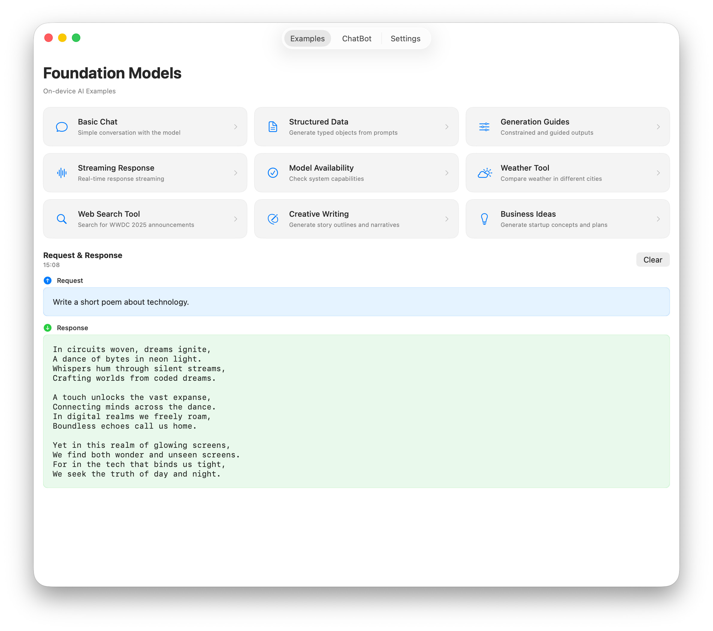

# Foundation Models Framework Example



A practical iOS app demonstrating Apple's Foundation Models framework with various examples of on-device AI capabilities.

## Support

Love this project? Check out my books to explore more of AI and iOS development:
- [Exploring AI for iOS Development](https://academy.rudrank.com/product/ai)
- [Exploring AI-Assisted Coding for iOS Development](https://academy.rudrank.com/product/ai-assisted-coding)

## Requirements

- iOS 26.0+ or macOS 26.0+
- Apple Intelligence enabled
- Compatible Apple device with Apple Silicon

## Features

### Core AI Capabilities
- **Basic Chat**: Simple conversational interactions
- **Structured Data Generation**: Type-safe data generation with `@Generable`
- **Generation Guides**: Constrained outputs with `@Guide` annotations
- **Streaming Responses**: Real-time response streaming
- **Tool Calling**: Custom tools for extended functionality
- **Model Availability**: System capability checking

### Creative Features
- **Creative Writing**: Story outline and narrative generation
- **Business Ideas**: Startup concept and business plan generation

### Custom Tools
- **Weather Tool**: Multi-city weather information with simulated data
- **Web Search Tool**: Real-time web search using Exa AI API

## Usage Examples

### Basic Chat
```swift
let session = LanguageModelSession()
let response = try await session.respond(
    to: "Suggest a catchy name for a new coffee shop."
)
print(response.content)
```

### Structured Data Generation
```swift
let session = LanguageModelSession()
let bookInfo = try await session.respond(
    to: "Suggest a sci-fi book.",
    generating: BookRecommendation.self
)
print("Title: \(bookInfo.content.title)")
print("Author: \(bookInfo.content.author)")
```

### Tool Calling
```swift
// Weather Tool
let weatherSession = LanguageModelSession(tools: [WeatherTool()])
let weatherResponse = try await weatherSession.respond(
    to: "Is it hotter in New Delhi or Cupertino?"
)
print(weatherResponse.content)

// Web Search Tool
let webSession = LanguageModelSession(tools: [WebTool()])
let webResponse = try await webSession.respond(
    to: "Search for the latest WWDC 2025 announcements"
)
print(webResponse.content)

// Reminders Tool
let remindersSession = LanguageModelSession(tools: [RemindersTool()])
let reminderResponse = try await remindersSession.respond(
    to: "Create a reminder to buy groceries tomorrow at 5 PM"
)
print(reminderResponse.content)

// Calendar Tool
let calendarSession = LanguageModelSession(tools: [CalendarTool()])
let calendarResponse = try await calendarSession.respond(
    to: "Schedule a meeting with the team next Monday at 2 PM for 1 hour"
)
print(calendarResponse.content)

// Multiple Tools
let multiSession = LanguageModelSession(tools: [
    WeatherTool(),
    CalendarTool(),
    RemindersTool()
])
let multiResponse = try await multiSession.respond(
    to: "Check the weather for tomorrow and if it's sunny, schedule an outdoor picnic at noon"
)
print(multiResponse.content)
```

### Streaming Responses
```swift
let session = LanguageModelSession()
let stream = session.streamResponse(to: "Write a short poem about technology.")

for try await partialText in stream {
    print("Partial: \(partialText)")
}
```

## Data Models

The app includes comprehensive `@Generable` data models:

### Book Recommendations
```swift
@Generable
struct BookRecommendation {
    @Guide(description: "The title of the book")
    let title: String
    
    @Guide(description: "The author's name")
    let author: String
    
    @Guide(description: "Genre of the book")
    let genre: Genre
}
```

### Product Reviews
```swift
@Generable
struct ProductReview {
    @Guide(description: "Product name")
    let productName: String
    
    @Guide(description: "Rating from 1 to 5")
    let rating: Int
    
    @Guide(description: "Key pros of the product")
    let pros: [String]
}
```

## Custom Tools

### Weather Tool
Provides real-time weather information using OpenMeteo API:
- Fetches current weather for any city worldwide
- Temperature, humidity, wind speed, and weather conditions
- Automatic geocoding for city names
- No API key required

### Web Search Tool
Real-time web search by Exa AI:
- Returns text content from web pages
- Configurable number of results (default: 5)
- Supports complex search queries and current events

**Setup Requirements:**
1. Get an API key from [Exa AI](https://exa.ai)
2. Add your API key in the app's Settings screen
3. The tool will automatically use the stored API key for searches

### Reminders Tool
Access and manage reminders using EventKit:
- Create, read, update, and complete reminders
- Query reminders by filter (all, incomplete, completed, today, overdue)
- Set due dates, priorities, and reminder lists
- Full integration with iOS Reminders app

### Calendar Tool
Manage calendar events using EventKit:
- Create, read, update, and delete calendar events
- Check availability for scheduling
- Support for recurring events
- Query events by time range
- Integration with all device calendars

### Contacts Tool
Access and manage contacts using Contacts framework:
- Search contacts by name
- Create new contacts with full details
- Update existing contact information
- Support for phone numbers, emails, birthdays, and notes
- Respects user privacy settings

### Location Tool
Location-based services using CoreLocation and MapKit:
- Get current location (with permission)
- Geocode addresses to coordinates
- Reverse geocode coordinates to addresses
- Calculate distances between locations
- Search for nearby places by category

### Notification Tool
Schedule and manage local notifications:
- Schedule time-based or calendar-based notifications
- Query pending notifications
- Cancel scheduled notifications
- Check notification permissions
- Support for repeating notifications

### Health Tool
Query health data using HealthKit:
- Access steps, heart rate, and workout data
- Query sleep patterns and calories burned
- Track walking/running distance
- Time-based data aggregation
- Respects health data privacy

### Photos Tool
Manage photos and albums using PhotoKit:
- Search photos by date, type, or location
- Browse and create albums
- Mark photos as favorites
- Get detailed photo metadata
- Support for screenshots, selfies, and videos

### Shortcuts Tool
Run Shortcuts app automations:
- List available shortcuts
- Execute shortcuts with parameters
- Pass input data to shortcuts
- Integrate with user-created automations
- Bridge AI capabilities with Shortcuts workflows


## Getting Started

1. Clone the repository
2. Open `FMF.xcodeproj` in Xcode
3. Ensure you have a device with Apple Intelligence enabled
4. Build and run the project
5. (Optional) For web search functionality:
   - Get an API key from [Exa AI](https://exa.ai)
   - Tap the gear icon in the app to access Settings
   - Enter your Exa API key in the settings screen
6. Explore the different AI capabilities through the example buttons

**Note:** All features except web search work without any additional setup. The web search tool requires an Exa API key for functionality.

## Required Permissions

The app will request the following permissions when using specific tools:

### Info.plist Keys Required
Add these keys to your `Info.plist` file with appropriate usage descriptions:

```xml
<!-- Reminders -->
<key>NSRemindersUsageDescription</key>
<string>This app needs access to your reminders to help manage tasks with AI assistance.</string>

<!-- Calendar -->
<key>NSCalendarsUsageDescription</key>
<string>This app needs access to your calendar to help schedule events with AI assistance.</string>

<!-- Contacts -->
<key>NSContactsUsageDescription</key>
<string>This app needs access to your contacts to help manage contact information with AI assistance.</string>

<!-- Location -->
<key>NSLocationWhenInUseUsageDescription</key>
<string>This app needs access to your location to provide location-based AI assistance.</string>

<!-- Notifications -->
<key>NSUserNotificationsUsageDescription</key>
<string>This app needs permission to send you notifications for reminders and alerts.</string>

<!-- Health -->
<key>NSHealthShareUsageDescription</key>
<string>This app needs access to your health data to provide AI-powered health insights.</string>
<key>NSHealthUpdateUsageDescription</key>
<string>This app needs permission to update your health data.</string>

<!-- Photos -->
<key>NSPhotoLibraryUsageDescription</key>
<string>This app needs access to your photos to help organize and search them with AI assistance.</string>
<key>NSPhotoLibraryAddUsageDescription</key>
<string>This app needs permission to save photos to your library.</string>
```


## Contributing

Contributions are welcome! Please feel free to submit a pull request.

## License

This project is licensed under the MIT License - see the LICENSE file for details.