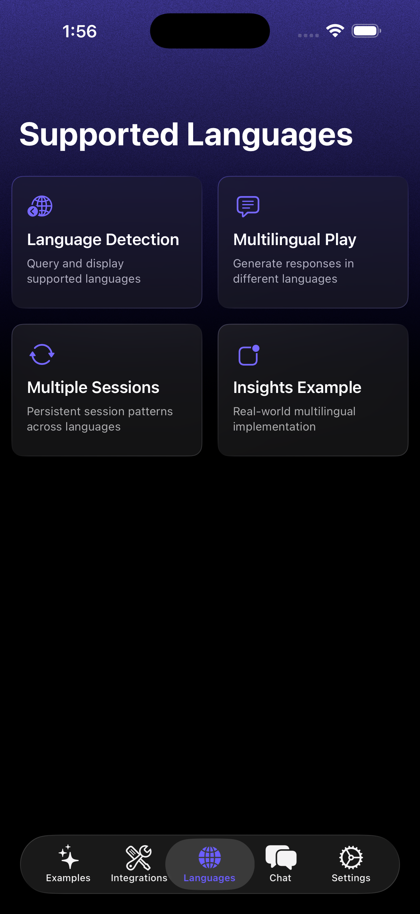

# Foundation Models Framework Example


<div align="center">
  <table>
    <tr>
      <td align="center" style="padding: 15px;">
        
        <br/>
        <strong>FMF Examples</strong>
      </td>
      <td align="center" style="padding: 15px;">
        
        <br/>
        <strong>FMF Tools</strong>
      </td>
    </tr>
    <tr>
      <td align="center" style="padding: 15px;">
        
        <br/>
        <strong>FMF Chat</strong>
      </td>
      <td align="center" style="padding: 15px;">
        
        <br/>
        <strong>FMF Languages</strong>
      </td>
    </tr>
  </table>
</div>

## Exploring Foundation Models

This project includes playground examples organized by chapters to help you learn everything about Apple's Foundation Models framework.

It is part of the [Exploring Foundation Models](https://academy.rudrank.com/product/foundation-models) book.

## Requirements

- iOS 26.0+ or macOS 26.0+ (Xcode 26.0+)
- **Xcode 26 official is required**
- Apple Intelligence enabled
- Compatible Apple device with Apple Silicon

## Try it on TestFlight

You can now try Foundation Lab on TestFlight! Join the beta: [https://testflight.apple.com/join/JWR9FpP3](https://testflight.apple.com/join/JWR9FpP3)

## Getting Started

- Clone the repository
- Open `FoundationLab.xcodeproj` in Xcode
- Ensure you have a device with Apple Intelligence enabled
- Build and run the project
- (Optional) For web search functionality:
  - Get an API key from [Exa AI](https://exa.ai)
  - Tap the gear icon in the app to access Settings
  - Enter your Exa API key in the settings screen
- Explore the different capabilities through the examples!

## What's Inside

The app has four main sections:

### Chat
Multi-turn conversations with context management, streaming responses, and a feedback system. Includes automatic context window management with session summarization when needed.

### Tools
Nine system integration tools that extend the model's capabilities:
- **Weather** - Current weather for any location (OpenMeteo API)
- **Web Search** - Real-time search via Exa AI (requires API key)
- **Contacts** - Search and access system contacts
- **Calendar** - Create and manage calendar events
- **Reminders** - AI-assisted reminder creation with priority levels
- **Location** - Current location and geocoding
- **Health** - HealthKit integration for health data queries
- **Music** - Apple Music search (requires subscription)
- **Web Metadata** - Extract metadata and generate social media summaries

### Voice Interface
Talk to the model using speech:
- Voice-to-text with real-time transcription
- Text-to-speech responses
- Create reminders by voice
- Audio-reactive visualization
- Handles all permissions automatically

### Health Dashboard
AI-powered health tracking with HealthKit:
- Personal health coach with contextual insights
- Trend analysis and correlations
- Predictive analytics
- Weekly summaries and personalized health plans
- Multiple health metrics tracking

### Integrations Hub
Three sections for exploring advanced features:
- **Tools** - All nine system integration examples
- **Schemas** - Dynamic schema examples from basic to expert level
- **Languages** - Multilingual features and language detection

### Examples
Ten different example types showing framework capabilities:
- One-shot prompts
- Business idea generation
- Creative writing
- Structured data generation
- Streaming responses
- Model availability checking
- Generation guides
- Generation options (temperature, tokens, fitness)
- Health dashboard
- RAG chat with document indexing and search

## Features

### Core Capabilities
- **Chat**: Multi-turn conversations with context management
- **Streaming**: Real-time response streaming
- **Structured Generation**: Type-safe data with `@Generable`
- **Generation Guides**: Constrained outputs with `@Guide`
- **Tool Calling**: System integrations for extended functionality
- **RAG**: Document indexing and semantic search with LumoKit/VecturaKit
- **Voice**: Speech-to-text and text-to-speech
- **Health**: HealthKit integration with AI insights
- **Multilingual**: Works in 10 languages (English, German, Spanish, French, Italian, Japanese, Korean, Portuguese, Chinese)

### Dynamic Schemas
The app includes 11 dynamic schema examples ranging from basic to expert:
- Basic schemas
- Arrays and collections
- Enums and union types
- Nested objects
- Schema references
- Form builders
- Invoice processing
- Error handling patterns

### Playground Examples
Four chapters with hands-on examples:
- **Chapter 2**: Getting Started with Sessions (16 examples)
- **Chapter 3**: Generation Options and Sampling Control (5 examples)
- **Chapter 8**: Basic Tool Use (9 examples)
- **Chapter 13**: Languages and Internationalization (7 examples)

Run these directly in Xcode using the `#Playground` directive.

## Usage Examples

### Basic Chat
```swift
let session = LanguageModelSession()
let response = try await session.respond(
    to: "Suggest a catchy name for a new coffee shop."
)
print(response.content)
```

### Structured Data Generation
```swift
let session = LanguageModelSession()
let bookInfo = try await session.respond(
    to: "Suggest a sci-fi book.",
    generating: BookRecommendation.self
)
print("Title: \(bookInfo.content.title)")
print("Author: \(bookInfo.content.author)")
```

### Tool Calling
```swift
// Single tool
let weatherSession = LanguageModelSession(tools: [WeatherTool()])
let response = try await weatherSession.respond(
    to: "Is it hotter in New Delhi or Cupertino?"
)

// Multiple tools
let multiSession = LanguageModelSession(tools: [
    WeatherTool(),
    WebTool(),
    ContactsTool()
])
let multiResponse = try await multiSession.respond(
    to: "Check the weather and find my friend John's contact"
)
```

### Streaming Responses
```swift
let session = LanguageModelSession()
let stream = session.streamResponse(to: "Write a short poem about technology.")

for try await partialText in stream {
    print("Partial: \(partialText)")
}
```

### Voice Interface
```swift
// Speech recognition
let recognizer = SpeechRecognizer()
try recognizer.startRecognition()

// Text-to-speech
try await SpeechSynthesizer.shared.synthesizeAndSpeak(text: "Hello, how can I help you?")
```

### Health Data
```swift
let session = LanguageModelSession(tools: [HealthDataTool()])
let response = try await session.respond(
    to: "Show me my step count trends this week"
)
```

## Data Models

The app includes various `@Generable` data models for different use cases:

### General Purpose
```swift
@Generable
struct BookRecommendation {
    @Guide(description: "The title of the book")
    let title: String

    @Guide(description: "The author's name")
    let author: String

    @Guide(description: "Genre of the book")
    let genre: Genre
}

@Generable
struct ProductReview {
    @Guide(description: "Product name")
    let productName: String

    @Guide(description: "Rating from 1 to 5")
    let rating: Int

    @Guide(description: "Key pros and cons")
    let pros: [String]
    let cons: [String]
}

@Generable
struct StoryOutline {
    let title: String
    let protagonist: String
    let conflict: String
    let setting: String
    let genre: StoryGenre
    let themes: [String]
}

@Generable
struct BusinessIdea {
    let name: String
    let description: String
    let targetMarket: String
    let revenueModel: String
    let advantages: [String]
    let estimatedStartupCost: String
    let timeline: String
}
```

### Health Models
```swift
@Generable
struct HealthAI {
    let greeting: String
    let mood: HealthAIMood
    let motivationalMessage: String
    let focusMetrics: [String]
    let suggestions: [String]
}

@Generable
struct HealthAnalysis {
    let healthScore: Int
    let trends: HealthTrends
    let insights: [HealthInsightDetail]
    let correlations: [MetricCorrelation]
    let predictions: [HealthPrediction]
    let recommendations: [String]
}

@Generable
struct PersonalizedHealthPlan {
    let title: String
    let overview: String
    let currentStatus: String
    let weeklyActivities: [String]
    let nutritionGuidelines: NutritionPlan
    let sleepStrategy: String
    let milestones: [String]
}
```

### Chat Context
```swift
@Generable
struct ConversationSummary {
    let summary: String
    let keyTopics: [String]
    let userPreferences: [String]
}
```

## Tools Details

### Weather Tool
- Uses OpenMeteo API for real-time weather
- Temperature, humidity, wind speed, conditions
- Automatic geocoding
- No API key required

### Web Search Tool
- Real-time search via Exa AI
- Returns text content from pages
- Requires API key from [Exa AI](https://exa.ai)
- Configure in Settings

### Contacts Tool
- Search system contacts
- Natural language queries
- Requires contacts permission

### Calendar Tool
- Create and manage events
- Timezone and locale aware
- Supports relative dates ("today", "tomorrow")
- Requires calendar permission

### Reminders Tool
- Create reminders with AI
- Priority levels: None, Low, Medium, High
- Due dates and notes
- Requires reminders permission

### Location Tool
- Current location information
- Geocoding support
- Requires location permission

### Health Tool
- HealthKit integration
- Query health metrics
- AI-powered insights
- Requires HealthKit permission

### Music Tool
- Apple Music search
- Songs, artists, albums
- Requires Apple Music subscription
- Requires music permission

### Web Metadata Tool
- Extract webpage metadata
- Generate social media summaries
- Platform-specific formatting
- No API key required

## Multilingual Support

The app works in 10 languages:
- English
- German
- Spanish
- French
- Italian
- Japanese
- Korean
- Portuguese (Brazil)
- Chinese (Simplified)
- Chinese (Traditional)

Language detection and code-switching examples are included in the Integrations section.

## Permissions

The app may request the following permissions depending on which features you use:
- Microphone (for voice input)
- Speech Recognition
- Contacts
- Calendar
- Reminders
- Location
- HealthKit
- Apple Music

All permissions are requested at the appropriate time and can be managed in Settings.

## Contributing

Contributions are welcome! Please feel free to submit a pull request.

## License

This project is licensed under the MIT License - see the LICENSE file for details.

[](https://star-history.com/#rudrankriyam/Foundation-Models-Framework-Example&Date)
